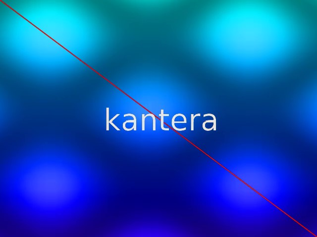

# Kantera
Video composition and rendering kit for Rust, depends on FFmpeg and cairo.

Kantera supports you create simple videos from few Rust code.



TODO:

- [ ] Import videos and images
- [x] Text rendering with any font
- [x] Output video with audio
- [ ] GUI
- [ ] Sound composition

## Concepts
- Orthogonal APIs

## Requirement

You need install them:

- FFmpeg
- cairo

## Usage (demo)

``` sh
$ cargo run --release --example demo
```

After a while, a video named `out.mp4` will be output to current directory.

## Author

* carrotflakes (carrotflakes@gmail.com)

## Copyright

Copyright (c) 2019 carrotflakes (carrotflakes@gmail.com)

## License

Licensed under the MIT License.
